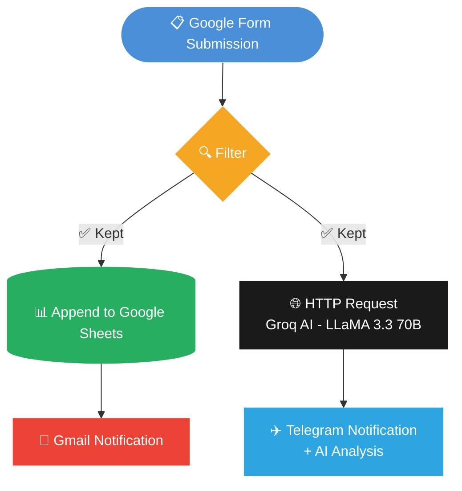

# 🤖 AI-Powered UMKM Inquiry Notifier

> Automated lead notification system for SMEs (UMKM) using n8n, Groq AI, Google Sheets, Gmail, and Telegram.


***

## 📌 Overview

This project is an **end-to-end automation workflow** that handles incoming business inquiries for UMKM (Usaha Mikro, Kecil, dan Menengah). When a customer submits an inquiry form, the system automatically:

1. **Filters** and validates the data
2. **Logs** the inquiry to Google Sheets
3. **Analyzes** the inquiry using AI (Groq LLaMA 3.3 70B)
4. **Notifies** the business owner via Telegram with AI-generated insights
5. **Sends** an email notification via Gmail

No manual checking, no missed leads. 🚀

***

## ⚙️ Workflow Architecture



### Nodes Breakdown

| Node | Type | Function |
|------|------|----------|
| **On form submission** | Trigger | Listens for new Google Form responses |
| **Filter** | Logic | Validates required fields before processing |
| **Append row in sheet** | Google Sheets | Logs all inquiry data for record-keeping |
| **HTTP Request** | API Call | Sends data to Groq AI for analysis |
| **Send a text message** | Telegram | Sends formatted AI analysis to business owner |
| **Send a message** | Gmail | Sends email notification backup |

***

## 🧠 AI Analysis Output

The Groq LLaMA 3.3 70B model analyzes each inquiry and returns a structured response:

```
🔔 Inquiry Baru Masuk!

👤 Nama: Budi Santoso
📱 WhatsApp: 081234567890
🛠️ Layanan: Redesign Website
📅 Tanggal: 2026-04-07
📝 Catatan: Tolong redesign website saya

🤖 Analisis AI:
⚡ Prioritas: TINGGI

📋 Ringkasan:
Klien membutuhkan jasa redesign website untuk
keperluan bisnis online-nya yang ingin diperbarui.

💬 Saran Follow-up:
Hubungi via WhatsApp dalam 2 jam untuk
mendiskusikan konsep dan estimasi biaya.

⏰ Masuk: 4/7/2026
```

***

## 🛠️ Tech Stack

- **[n8n](https://n8n.io/)** — Low-code workflow automation platform
- **[Groq API](https://console.groq.com/)** — Ultra-fast AI inference (LLaMA 3.3 70B Versatile)
- **Google Forms + Sheets** — Form intake & data logging
- **Telegram Bot API** — Real-time mobile notifications
- **Gmail API** — Email notification backup

***

## 🚀 How to Set Up

### Prerequisites

- n8n instance (cloud or self-hosted)
- Groq API key → [Get it here](https://console.groq.com/)
- Google account (for Forms + Sheets + Gmail)
- Telegram Bot Token → Create via [@BotFather](https://t.me/BotFather)

### Steps

1. **Clone or import the workflow** into your n8n instance
2. **Set up credentials** in n8n:
   - Google OAuth2 (for Sheets + Gmail)
   - Telegram Bot API
   - Groq API key as HTTP Header Auth (`Bearer YOUR_API_KEY`)
3. **Connect your Google Form** to the trigger node
4. **Create a Google Sheet** and connect it to the Append node
5. **Set your Telegram Chat ID** in the Telegram node
6. **Activate the workflow** and test with a sample form submission

### Environment Variables / Credentials

| Credential | Where to get |
|-----------|--------------|
| `GROQ_API_KEY` | [console.groq.com](https://console.groq.com) |
| `TELEGRAM_BOT_TOKEN` | [@BotFather on Telegram](https://t.me/BotFather) |
| `TELEGRAM_CHAT_ID` | [@userinfobot on Telegram](https://t.me/userinfobot) |
| Google OAuth | n8n Credentials → Google OAuth2 |

> ⚠️ **Important:** After importing `workflow.json`, all credentials (Groq, Telegram, and Google OAuth) need to be reconnected using your own accounts in n8n Credentials settings. The workflow file does not store any API keys or tokens.

***

## 📊 Google Sheets Structure

The workflow logs every inquiry with the following columns:

| Nama Lengkap | Nomor WhatsApp | Jenis Layanan | Tanggal Diinginkan | Catatan Tambahan |
|---|---|---|---|---|
| John Doe | 08123456789 | Redesign Website | 2026-04-07 | ... |

***

## 💡 Use Cases

- **Freelancers** — Never miss a client inquiry while working on a project
- **UMKM owners** — Get instant AI-prioritized leads without checking email constantly
- **Digital agencies** — Auto-log and triage incoming project requests
- **Service businesses** — Any business using Google Forms for intake

***

## 📁 Project Structure

```
umkm-inquiry-notifier/
├── README.md
├── workflow.json          ← n8n exported workflow (import directly)
└── assets/
    └── workflow-screenshot.png
```

***

## 👤 Author

**Zeldano Shan Oeffie**  
📧 [kerjaanzeldano@gmail.com](mailto:kerjaanzeldano@gmail.com)  
✍️ [Medium](https://medium.com/@kerjaanzeldano)  
🔗 [GitHub](https://github.com/zeldano118)

***

## 📄 License

This project is open source and available under the [MIT License](LICENSE).

***

> 💬 *Built as a portfolio project to demonstrate n8n automation + AI integration skills for UMKM digital transformation.*
